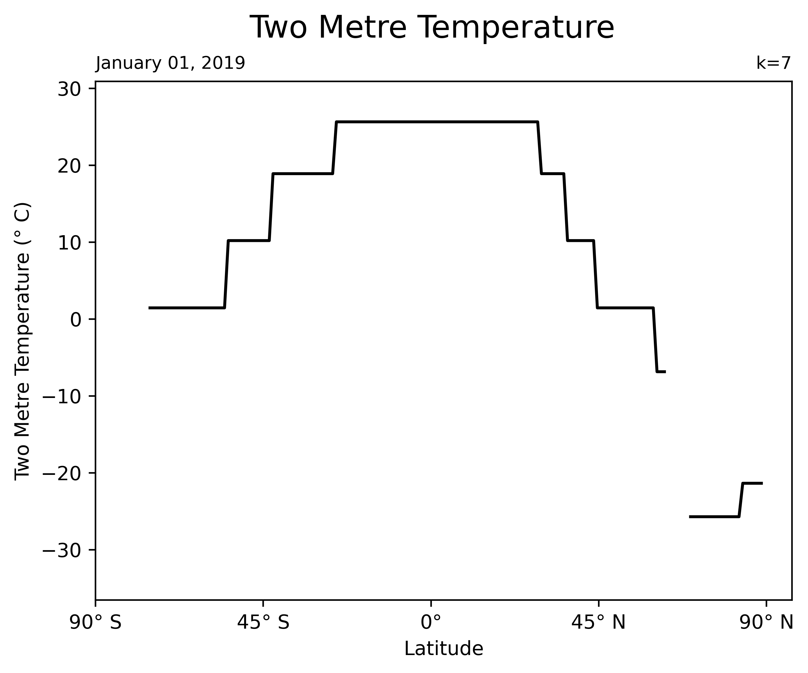
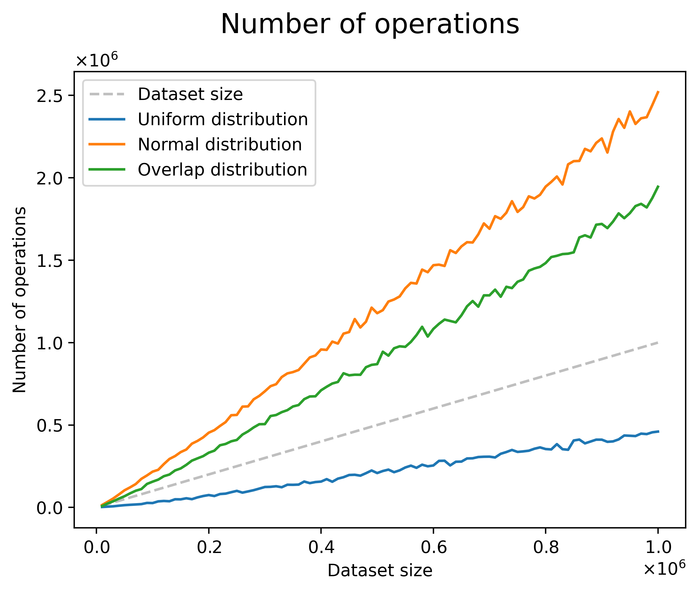

# Visuals

- [Visualization examples](https://www.youtube.com/playlist?list=PLLn6Js4j5qP1o3g27v4sOXLWSK2FN5TtM)

## Overview

Visualizations have been generated with k values (number of clusters) from 5-10. We visualize the data by creating a image snapshot for each day in 2019. We then compiled each image into a year-long video representation of the data. These visualization videos can be found in this [YouTube playlist](https://www.youtube.com/playlist?list=PLLn6Js4j5qP1o3g27v4sOXLWSK2FN5TtM).

## Types of visualizations

1. Map

1. Line graph

### Visualized variables

We ran the clustering algorithm on three different variables from the ERA5 dataset:

- Mean sea level pressure
- Sea surface temperature
- Two metre temperature

## Performance analysis visualization

