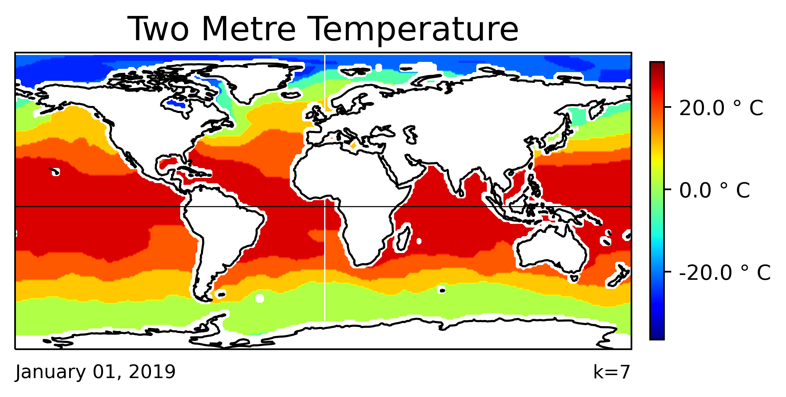

# Visuals

- [Example of visualization output](map/k=7/two_metre_temperature)
- [Example of visualization video](map/k=7/two_metre_temperature/_two_metre_temperature_30.mp4)
- [Visualization of performance analysis](performance)

## Overview

Visualizations have been generated for with k values from 5-10. We visualize the data by creating a image snapshot for each day in 2019. We then compiled each image into a year-long video representation of the data ([example](map/k=7/two_metre_temperature/_two_metre_temperature_30.mp4)). To conserve space in our submission, we have only included the first image from every month (although these images can be easily regenerated)

## Types of visualizations

1. Map
2. Line graph

## Performance analysis visualization

